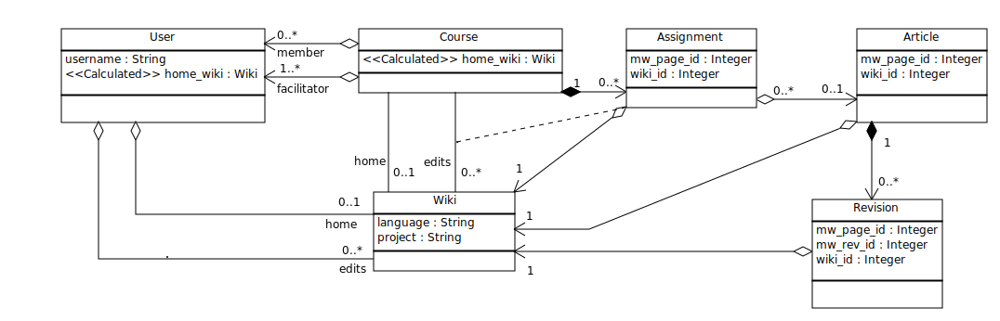

Background
==========
This application was originally written for English Wikipedia, and for
convenience the primary IDs of many entities were kept in sync with MediaWiki
database IDs.

Multiwiki feature
==================
In February 2016, we've added support for articles from any of the [Wikimedia
project wikis](https://meta.wikimedia.org/wiki/Wikimedia_wikis#Core_projects),
which involves database schema and code changes.  The `Wiki` table will hold
one record for each wiki referenced from the application, and all onwiki
entities will link to that row.  The entity primary IDs will be decoupled from
MediaWiki ID and new `mw_page_id` columns added to hold the MediaWiki primary
ID.  All code will be rewritten to distinguish between cases where we want the
MediaWiki ID (during sync and deduplication), or the local primary ID
(concisely identifies local articles).

The new schema looks like this:

We haven't finished designing how User and Course associate with wikis, so we
use two shorthand concepts for the moment.  There is the list of wikis that each
user and collectively, each course edits.  One wiki from this list is arbitrarily
chosen as the home wiki, otherwise we fall back to the application default wiki.
This is a pretty bad guess, and will be changed in the future.  Having a home
wiki is helpful to minimize code changes during this refactor, but we don't
know whether we even want such a property.

Migration
=========
There will be a one-time schema migration, which is mostly reversible in case
of rollback.  Since everything in the application database is on the default
wiki, we can simply copy the primary IDs over to the MediaWiki ID columns, and
set the wiki to our default record.

As multiwiki entities are added to the system, the reverse migration will get
riskier.  If two entities have the same MediaWiki primary ID, one will be lost
during a rollback.  We should test for this condition manually if that becomes
necessary, the migration itself doesn't include error checking.

The refactor is split into two branches, the first, `wiki_schema`, creates
a schema without making logic changes.  The second, `use_native_ids`, rewrites
the application to distinguish between local article ID and MediaWiki page ID.
That branch is organized with safe patches towards the beginning, and riskier
ones towards the end, so that a partial rollback is possible if required.
Partially rolled back code will be protected by the default value logic, and
will create valid records, but will only handle English Wikipedia articles, so
should be corrected and redeployed as quickly as possible.

Future plans
============
Once the transitional code is deployed and stable, we'll want to take one more
pass through the code, and tighten up all of the soft backwards-compatibility.
For example, we'll no longer set the wiki to the application default as a
fallback, if we fail to make that association from the main business logic.
Instead, we should fail fast, log the event, and even crash the application.

The Wiki entity can be extended to support exotic wikis like Commons and Meta,
or even third-party and local wikis, if desirable.
